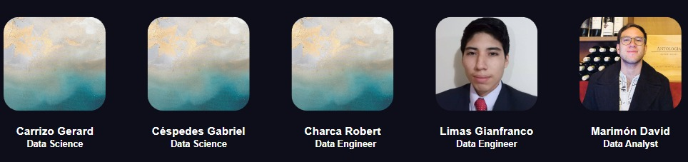

# <h1 align=center>**`Bank Fraud Detection Application`**</h1>


## 1. Objetivos
- Definir cuáles son las variables que más pueden ayudar a predecir la probabilidad del fraude de la solicitud de una cuenta bancaria.
- Enseñar a un modelo de Machine Learning que ayude, con las variables establecidas del modelo, a predecir la probabilidad de fraude de la solicitud de una cuenta bancaria.
- Crear un dashboard que exponga las tendencias de las solicitudes fraudulentas de creación de cuentas bancarias.

## 2. Integrantes

<p align="center">
  
</p>


<div align="center">

<table>
  <thead>
    <tr>
      <th>Name</th>
      <th>Rol</th>
      <th></th>
      <th></th>
    </tr>
  </thead>
  <tbody>
    <tr>
      <td><b>Gabriel Céspedes</b></td>
      <td>Project Manager (PM), Data Engineer, Data Analyst</td>
      <td><a href="https://github.com/gabrielcespedes">gabrielcespedes</a></td>
      <td><a href="https://www.linkedin.com/in/gabriel-cespedes-alarcon/">Gabriel Céspedes Alarcón</a></td>
    </tr>
    <tr>
      <td><b>Robert Charca</b></td>
      <td>ML Engineer and Data Scientist</td>
      <td><a href="https://github.com/robertcharca">robertcharca</a></td>
      <td><a href="https://www.linkedin.com/in/robert-charca-123b28293/">Robert Charca</a></td>
    </tr>
    <tr>
      <td><b>David Marimón</b></td>
      <td>ML Engineer and Data Scientist</td>
      <td><a href="https://github.com/DaAnMaGi">DaAnMaGi</a></td>
      <td><a href="https://www.linkedin.com/in/daanmagi/">David Andrés Marimón Gil</a></td>
    </tr>
    <tr>
      <td><b>Gianfranco Limas</b></td>
      <td>ML Engineer and Data Scientist</td>
      <td><a href="https://github.com/xlSosdee">xlSosdee</a></td>
      <td><a href="https://www.linkedin.com/in/gianfranco-limas/">Gianfranco Limas</a></td>
    </tr>
    <tr>
      <td><b>Gerardo Carrizo</b></td>
      <td>ML Engineer and Data Scientist</td>
      <td><a href="https://github.com/Gerardgfc">Gerardgfc</a></td>
      <td><a href="https://www.linkedin.com/in/gerardo-carrizo/">Gerardo Carrizo</a></td>
    </tr>
  </tbody>
</table>

</div>

## 3. Descripción del Proyecto
Este proyecto tiene como objetivo desarrollar una herramienta de Machine Learning que ayude a los bancos a identificar posibles fraudes al momento de abrir nuevas cuentas. La herramienta predice la probabilidad de fraude y destaca las características clave que pueden ayudar en su detección. Además, se desplegará un modelo de Business Intelligence a través de un dashboard.

### 3.1. Problema
El fraude en la apertura de nuevas cuentas bancarias es una amenaza creciente para las instituciones financieras. Los ciberdelincuentes crean cuentas falsas utilizando datos robados o engañosos para cometer estafas, robos o lavado de dinero. Detectar este tipo de fraude es complicado porque ocurre al inicio de la relación del cliente con el banco, cuando hay poca información histórica disponible. Este proyecto busca mitigar estos riesgos sin afectar negativamente la experiencia del usuario al abrir una nueva cuenta.

### 3.2. Solución
La solución propuesta es un sistema de Machine Learning que analiza datos de nuevas solicitudes de cuentas bancarias para identificar posibles casos de fraude. El modelo utiliza diversas características para predecir la probabilidad de fraude en tiempo real, proporcionando alertas tempranas a los bancos para que puedan tomar decisiones informadas sin afectar la experiencia del usuario legítimo. Además, se implementará un dashboard de Business Intelligence que permitirá a los usuarios visualizar las predicciones y obtener información clave sobre las características que influyen en la detección de fraude.

## 4. Data Stack
Las tecnologías que se usarán hasta el momento son los siguientes:
- Python.
- Numpy.
- Pandas.
- SciKit-Learn.
- AWS.
- PowerBI / Tableau.


## 5. Sobre el Proyecto

### 5.1. Estructura del Proyecto
```
c21-50-m-data-bi/
├─ data_pipeline/
├─ notebooks/
│  ├─ eda/
│  ├─ experimentation/
├─ src/
│  ├─ api/
│  ├─ data_workflow/
│  ├─ ml_workflow/
│  ├─ utils/
├─ tests/
│  ├─ api_tests/
│  ├─ data_tests/
│  ├─ ml_tests/
├─ README.md
├─ LICENSE
├─ aws_cloudformation.yml
├─ .gitignore

```

## 6. Configuración de Variables de Entorno

Para configurar las credenciales de acceso de los usuarios, utiliza variables de entorno en un archivo `.env` en la raíz del proyecto. Estas credenciales son necesarias para que los asesores bancarios puedan acceder al formulario de carga de archivos de predicción.

### Ejemplo de Archivo `.env`

Crea un archivo llamado `.env` con la siguiente estructura para definir las credenciales de los usuarios y la clave secreta de la aplicación:

```plaintext
# Credenciales de acceso
USUARIO_ASESOR1=asesor1
CONTRASEÑA_ASESOR1=password123

USUARIO_ASESOR2=asesor2
CONTRASEÑA_ASESOR2=password456

# Clave secreta de la aplicación
SECRET_KEY=clave_secreta_segura
```

## 7. Referencias
- Lanzito, Christina. (2024) Identity Fraud Cost Americans $43 Billion in 2023. AARP. [Enlace](https://www.aarp.org/money/scams-fraud/info-2024/identity-fraud-report.html)
- OpenSpan. (S.f.). New Account Fraud.[Enlace](https://www.onespan.com/topics/new-account-fraud)
- Microblink (2024). Fraude en cuentas nuevas: Comprender las señales de advertencia.[Enlace](https://microblink.com/es/resources/blog/fraude-en-cuentas-nuevas-comprender-las-senales-de-advertencia/#:~:text=A%20veces%20llamado%20%C2%ABfraude%20de,u%20obtenida%20mediante%20ingenier%C3%ADa%20social.)
- TransUnion (2024). 2024 State of Omnichannel Fraud. [Enlace](https://www.transunion.com/report/omnichannel-fraud-report?utm_campaign=PR+Global+Fraud+March+2024&utm_medium=press-release&utm_source=press-release&utm_content=PR+Global+Fraud+March+2024&atvy=%7B%22254739%22%3A%22Experience+B%22%7D)
- Veiga, João. (2024). Cracking the New Account Fraud Code: A Guide for Banks. Feedzai [Enlace](https://feedzai.com/blog/cracking-the-new-account-fraud-code-a-guide-for-banks/)
- Arkose Lab (s.f.). Banking New Account Fraud Detection. [Enlace](https://www.arkoselabs.com/new-account-fraud/banking-new-account-fraud-detection-explained/)
- Fraud.net. (s.f.). New Account Fraud: Understanding the Tactics & Techniques of Scammers. [Enlace](https://fraud.net/n/new-account-fraud-understanding-the-tactics-techniques-of-scammers/)
- Fraud.net. (s.f.). Detecting & Preventing New Account Fraud: Key Steps & Strategies. [Enlace](https://fraud.net/n/detecting-preventing-new-account-fraud-key-steps-strategies/)
